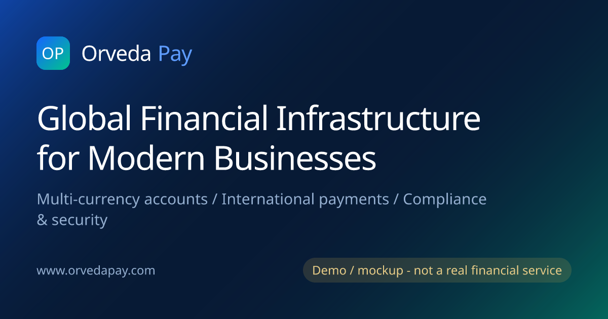
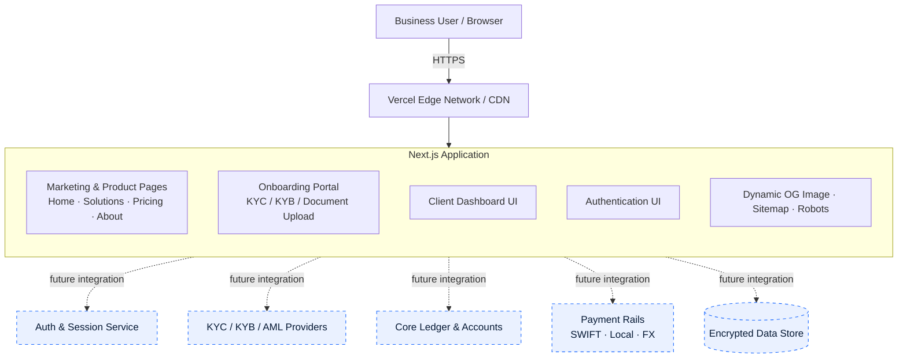
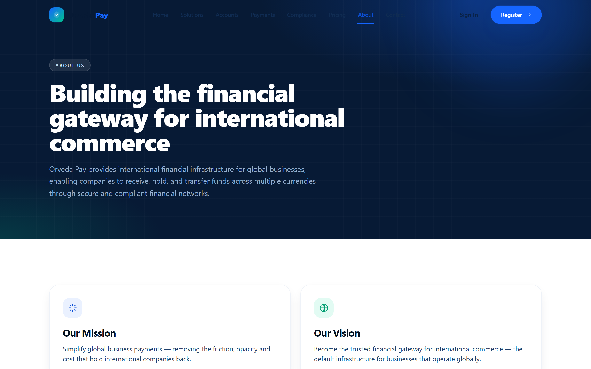
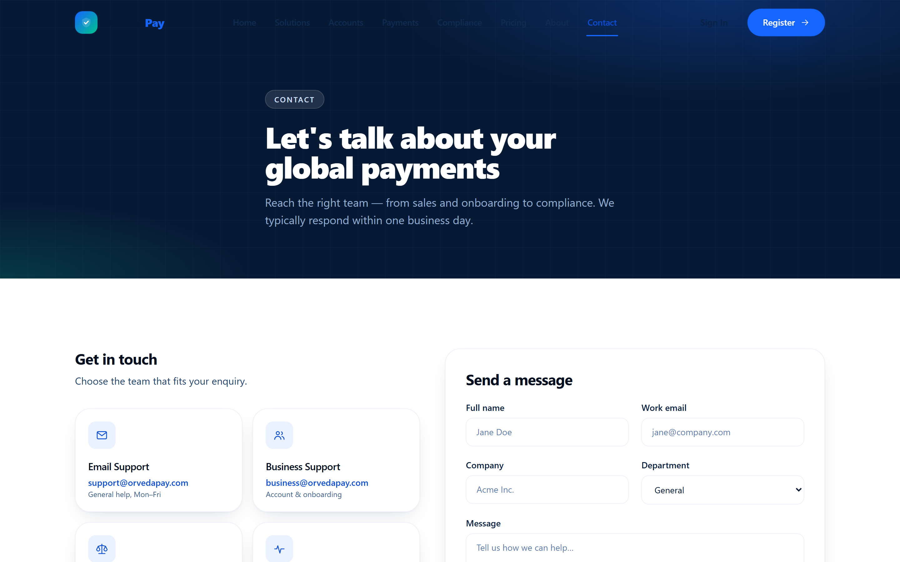
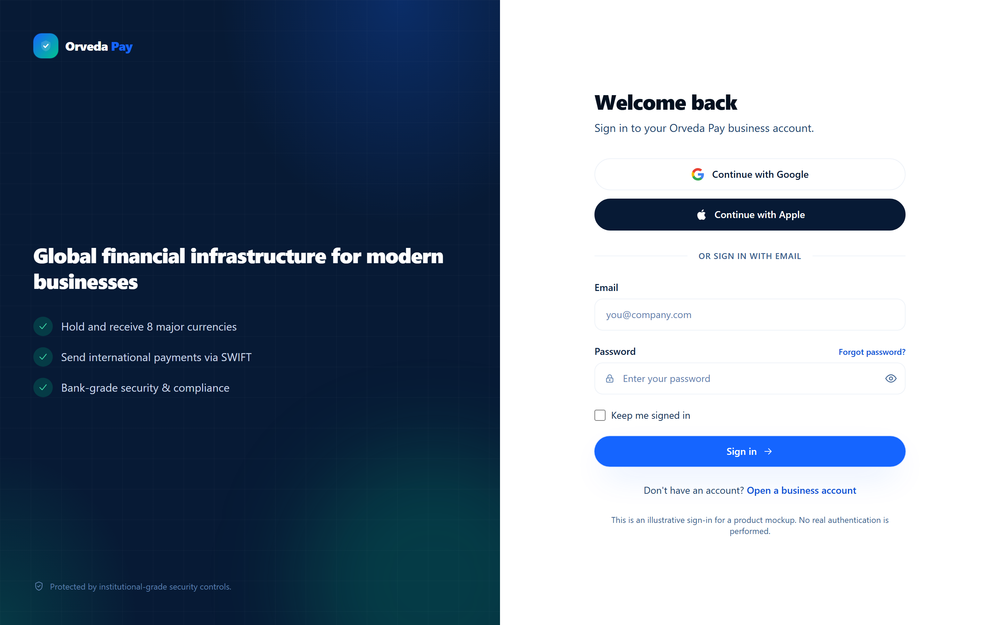

<!-- BANNER / HERO -->
<p align="center">
  
</p>

<h1 align="center">Orveda Pay</h1>

<p align="center">
  <strong>Global financial infrastructure for modern businesses — a fintech platform prototype.</strong><br/>
  Multi-currency business accounts · International payments · Compliance-first onboarding
</p>

<p align="center">
  <a href="https://www.orvedapay.com"></a>
  
  
</p>

<p align="center">
  
  
  
  
  
  
</p>

> [!IMPORTANT]
> **Orveda Pay is a financial technology platform prototype and product demonstration.**
> It is **not** a licensed, regulated, or operational financial institution, and it does
> **not** process real funds, real payments, or real customer onboarding. All dashboard
> figures and transactions shown are illustrative sample data. See
> [Security & Compliance Considerations](#-security--compliance-considerations).

---

## 📌 Product Overview

**Orveda Pay** is a digital banking product concept that demonstrates the end-to-end
experience of a cross-border financial operations platform for modern businesses.
It models how a company would open a **multi-currency business account**, complete a
**compliance-first onboarding** flow (KYC/KYB/AML), **receive international payments**,
and **settle cross-border transfers** — presented through a production-grade,
enterprise-quality web experience.

The project exists to showcase:

- **Product thinking** — how a serious fintech onboarding and money-movement journey is structured.
- **Design craft** — an ultra-modern, trust-oriented UI in line with leading global fintechs.
- **Engineering quality** — a clean, typed, performant Next.js codebase and architecture.
- **Licensing-ready architecture** — a structure designed with future regulatory compliance considerations in mind, so the concept could evolve toward a real, authorized product.

🔗 **Live demonstration:** **[www.orvedapay.com](https://www.orvedapay.com)**

---

## ✨ Key Features

| Area | What it demonstrates |
| --- | --- |
| 🏦 **Multi-Currency Accounts** | Hold and receive 8 major currencies (USD, EUR, GBP, AED, CAD, AUD, CHF, SGD) with local receiving details |
| 🌍 **International Payments** | SWIFT transfers, cross-border settlement, supplier payouts, and global collections flows |
| 🧾 **Business Onboarding Portal** | Multi-step KYC/KYB application with company, director, and contact data + encrypted document upload (drag & drop, validation, progress) |
| 🛡️ **Compliance & Security** | KYC, KYB, AML screening, risk monitoring, and fraud-prevention concepts presented as product surfaces |
| 📊 **Client Dashboard** | Balances, transactions, currency exchange, compliance status, and notifications (illustrative data) |
| 🔐 **Authentication UI** | Sign-in experience with email/password and social sign-in patterns (prototype) |
| 💳 **Pricing & Plans** | Transparent, tiered pricing presentation with FAQ |
| ⚡ **Performance & SEO** | Statically rendered pages, metadata, sitemap, robots, Open Graph & favicons |

---

## 🏗️ Platform Architecture

Orveda Pay is built as a modern, server-rendered web application on the Next.js App
Router, deployed on Vercel's edge network. The current prototype is **front-end and
presentation focused**; the architecture below also indicates where regulated backend
services would integrate in a production build.



**Design principles**

- **Component-driven UI** — reusable, typed React components with a shared design system (tokens for color, typography, motion).
- **Edge-first delivery** — static prerendering for marketing/product pages; dynamic rendering only where needed (e.g., generated social images).
- **Separation of concerns** — presentation today, with clearly marked integration points for regulated services tomorrow.
- **Accessibility & SEO** — semantic markup, focus states, per-page metadata, canonical URLs, sitemap, and robots.

---

## 🖼️ Screenshots

> Captured from the live deployment at [www.orvedapay.com](https://www.orvedapay.com).

### Home — Global Financial Infrastructure


### Solutions


### Multi-Currency Accounts


### International Payments


### Compliance & Security


### Pricing


### About


### Contact


### Business Onboarding Portal


### Client Dashboard (illustrative data)


### Sign In


---

## 🧰 Technology Stack

| Layer | Technology |
| --- | --- |
| **Framework** | [Next.js 14](https://nextjs.org/) (App Router) |
| **Language** | [TypeScript 5](https://www.typescriptlang.org/) |
| **UI Library** | [React 18](https://react.dev/) |
| **Styling** | [Tailwind CSS 3](https://tailwindcss.com/) with a custom design system |
| **Animation** | [Framer Motion 11](https://www.framer.com/motion/) |
| **Imagery** | Dynamic Open Graph image generation via `next/og` (Edge runtime) |
| **Fonts** | Inter & Manrope via `next/font` (self-hosted, optimized) |
| **Hosting** | [Vercel](https://vercel.com/) (edge network, automatic CI/CD from GitHub) |
| **SEO** | Built-in sitemap & robots, per-page metadata, canonical URLs, web manifest |
| **Tooling** | Playwright (screenshot automation), Sharp (icon generation) — dev only |

---

## 🔐 Security & Compliance Considerations

> **Status: prototype.** The points below describe the product concept and the
> architecture's intended direction. They are **not** statements that any regulatory
> approval, license, certification, or audit has been obtained.

**Current prototype**
- Served entirely over **HTTPS/TLS** with automatic certificates.
- **No real funds, payments, or transfers** are processed.
- Dashboard balances and transactions are **illustrative sample data**.
- A visible demonstration notice is shown in the application.

**Designed with future regulatory compliance considerations**
- **KYC / KYB** identity and business verification flows as first-class product surfaces.
- **AML screening** and **risk-monitoring** concepts surfaced in the UX.
- **Encrypted document handling** patterns for onboarding artifacts.
- Clear **integration points** for regulated providers (identity, screening, ledger, payment rails).

**What a production, authorized build would require (not yet in place)**
- A licensed or sponsored regulatory framework appropriate to each operating jurisdiction.
- Real identity/AML verification providers, audited security controls, and a secured backend.
- Independent security assessment and data-protection (e.g., privacy-by-design) review.

📄 The repository also includes illustrative legal pages (Privacy Policy, Terms & Conditions, AML Policy) authored for demonstration purposes.

---

## 🗺️ Product Roadmap

> Indicative direction for evolving the prototype toward a production concept.

- [x] **Phase 0 — Product & Brand** · UX, design system, marketing & product pages
- [x] **Phase 1 — Experience Prototype** · Onboarding portal, dashboard UI, auth UI, SEO
- [ ] **Phase 2 — Real Authentication** · OAuth / email auth, session management, user records
- [ ] **Phase 3 — Backend & Data** · Encrypted data store, API layer, real account state
- [ ] **Phase 4 — Verified Onboarding** · Integrated KYC/KYB/AML provider workflows
- [ ] **Phase 5 — Payments Integration** · Sandbox payment-rail and FX integrations
- [ ] **Phase 6 — Compliance & Hardening** · Security assessment, regulatory framework, audits

---

## 🚀 Deployment Information

- **Production URL:** **[https://www.orvedapay.com](https://www.orvedapay.com)**
- **Hosting:** Vercel — automatic production deployments on every push to `main`.
- **Build:** `next build` (static prerendering + edge functions for dynamic image generation).

### Run locally

```bash
# 1. Install dependencies
npm install

# 2. Start the dev server
npm run dev          # http://localhost:3000

# 3. Production build
npm run build && npm run start
```

### Project structure

```
orveda-pay/
├─ app/                # Next.js App Router: pages, layout, route handlers
│  ├─ (pages)/         # home, solutions, pricing, about, contact, legal, …
│  ├─ dashboard/       # client dashboard UI
│  ├─ register/        # business onboarding portal
│  ├─ signin/          # authentication UI
│  ├─ og/              # dynamic Open Graph image (Edge)
│  ├─ sitemap.ts       # SEO sitemap
│  └─ robots.ts        # SEO robots
├─ components/         # reusable UI components (Header, Footer, sections, icons)
├─ lib/                # shared helpers (SEO metadata builder)
├─ public/             # static assets, favicons, verification files
├─ docs/               # README banner & screenshots
└─ scripts/            # icon + screenshot generation (dev tooling)
```

---

## 👤 Author

**Aras Ghorbani** — Product & Front-End Engineering

Designed and built the Orveda Pay product concept end to end: brand, UX, design system,
and a production-grade Next.js implementation deployed on Vercel.

- GitHub: [@arasghorbani9090-web](https://github.com/arasghorbani9090-web)

---

## 📬 Contact

For product, partnership, or technical inquiries regarding this prototype:

- 🌐 Website: [www.orvedapay.com](https://www.orvedapay.com)
- ✉️ Email: hello@orvedapay.com
- 💬 Sales / Partnerships: sales@orvedapay.com

---

<p align="center">
  <sub>© 2026 Orveda Pay · A financial technology platform prototype. Not a licensed or operational financial service.</sub>
</p>
