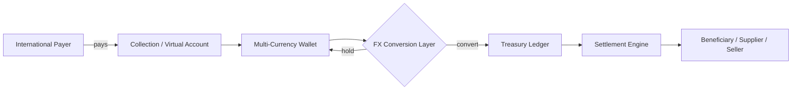
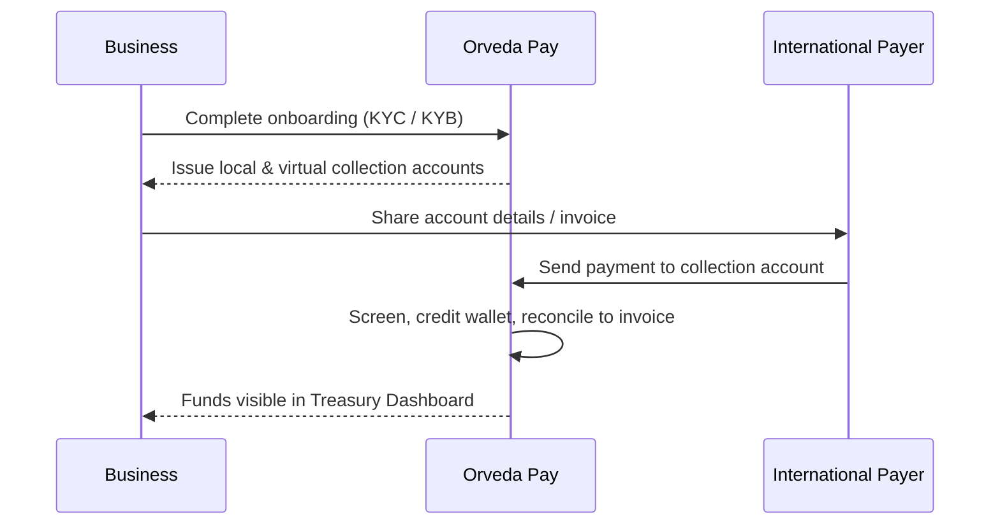
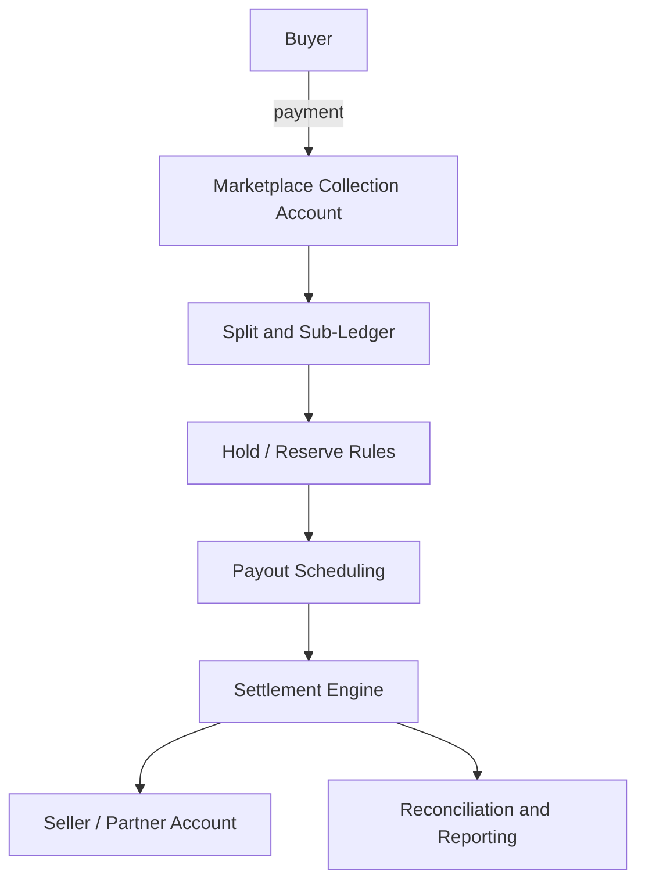
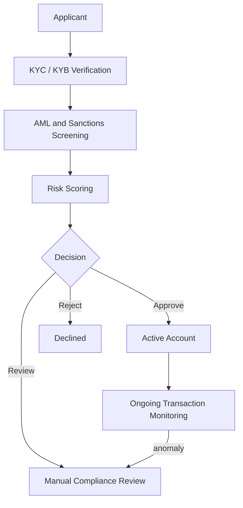
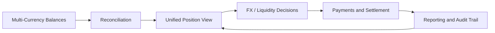
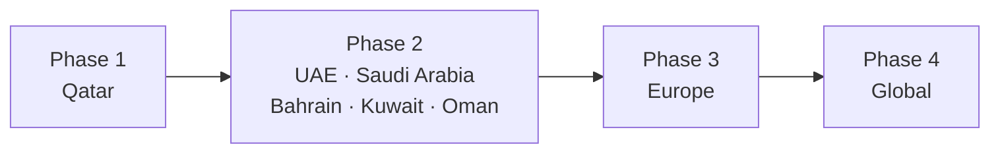
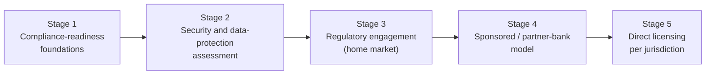

<!-- HERO -->

  

<h1 align="center">Orveda Pay — Global Account Collection &amp; Settlement Platform</h1>

  <strong>GCC-focused financial infrastructure for collecting, holding, converting, and settling funds across multiple countries and currencies — through one unified treasury environment.</strong>

  
  
  

  
  
  
  
  
  

### Positioning

- 🌐 **GCC-focused financial infrastructure platform**
- 🏢 **Corporate collection &amp; settlement network**
- 💰 **Multi-currency treasury platform**
- 🔁 **Cross-border payment orchestration system**
- 🛡️ **Future-ready compliance architecture**
- 🎯 **Designed for enterprises, SMEs, and international trade**

> [!IMPORTANT]
> **Forward-looking concept — please read.**
> Orveda Pay is an **early-stage product concept and working prototype**. It is **not** a licensed,
> regulated, or authorized financial institution, payment institution, e-money issuer, or bank.
> It **holds no license or regulatory approval**, has **no banking authorization**, and **does not
> process real customer funds, payments, or onboarding**. Every capability here describes **product
> vision and future regulatory-readiness objectives**, not current legal, operational, or licensing
> status. Company references denote *category positioning only* — no affiliation, partnership, or
> endorsement is implied. All statements are portfolio-oriented and forward-looking.

---

## 📖 Documentation Portal

| Document | Description |
| --- | --- |
| **README** (this file) | Executive whitepaper & platform overview |
| [Architecture](docs/architecture.md) | Layered architecture, components, and data flows |
| [Regulatory Readiness](docs/regulatory-readiness.md) | KYC / KYB / AML / monitoring as capabilities & future objectives |
| [GCC Expansion Strategy](docs/gcc-expansion.md) | Phased market-entry plan |
| [Product Roadmap](docs/roadmap.md) | Three-year roadmap |

---

## 1. Executive Summary

**Orveda Pay** is a financial-technology platform concept that gives global businesses a single
environment to **collect, hold, convert, and settle money across borders**. Companies operating
internationally today stitch together multiple banks, payment providers, and spreadsheets — each
with its own currencies, cut-off times, fees, and reporting — producing fragmented liquidity, slow
settlement, and poor treasury visibility.

Orveda Pay envisions a **unified treasury layer**: global collection and virtual accounts that let a
business *receive like a local* in many markets, multi-currency wallets to *hold what they earn*, an
FX layer to *convert on their terms*, and a settlement engine to *pay out and reconcile* — all behind
one API-first platform.

The strategy is **GCC-first**, beginning in **Qatar**, expanding across the wider Gulf, into Europe,
and then globally. The concept sits in the same category as global account/collection and treasury
platforms — comparable in *category* to **Wise Business, Airwallex, PingPong, Payoneer, and Modern
Treasury** — while focusing first on the specific needs of GCC enterprises, SMEs, marketplaces, and
international trade.

This repository contains the **product vision, architecture, and a production-grade UI prototype**
([live](https://www.orvedapay.com)) demonstrating the intended experience.

---

## 2. Market Problem

Cross-border commerce is growing, yet the financial plumbing beneath it remains fragmented, manual,
and slow. Businesses operating across borders consistently face:

- **🌍 Fragmented international payments** — different providers and rails per corridor, each with separate logins, fees, currencies, and timelines.
- **🏦 Multi-bank management complexity** — accounts across several banks and countries multiply operational overhead, duplicated KYC, and reconciliation effort.
- **🧾 Account collection challenges** — receiving from international buyers, marketplaces, and platforms often requires local accounts the business cannot easily obtain.
- **📊 Treasury visibility gaps** — cash scattered across institutions and currencies leaves finance teams without a single real-time view of position and exposure.
- **⏳ Settlement delays** — funds sit in transit for days; payouts to suppliers, sellers, and staff are slow and hard to schedule.
- **🔁 Cross-border reconciliation** — matching incoming payments to invoices across currencies, references, and timezones is error-prone and labor-intensive.

**Why now:** cross-border B2B payment flows are measured in the tens of trillions of dollars
annually (industry context, not an Orveda metric); digital-first businesses are expanding into new
markets faster than ever; and the GCC is investing heavily in financial-services modernization —
creating room for a treasury-grade, region-first platform.

---

## 3. Product Vision

Nine integrated capabilities that together form a unified treasury environment:

| # | Capability | What it does (concept) |
| --- | --- | --- |
| 1 | **Global Account Collection** | Receive funds internationally through local and virtual collection accounts. |
| 2 | **Multi-Currency Wallets** | Hold balances in multiple currencies; convert only when advantageous. |
| 3 | **Merchant Accounts** | Dedicated accounts for businesses and marketplaces to receive and organize revenue. |
| 4 | **Virtual Accounts** | Programmatic account details for collections, sub-ledgers, and per-customer references. |
| 5 | **Treasury Dashboard** | A single real-time view of balances, flows, exposure, and reconciliation. |
| 6 | **Settlement Engine** | Schedule, batch, and execute payouts with predictable timing and audit trails. |
| 7 | **FX Conversion Layer** | Transparent currency conversion with clear pricing at the point of action. |
| 8 | **Corporate Payments Hub** | Supplier, payroll, and B2B payments from one control plane. |
| 9 | **Marketplace Payout Infrastructure** | Split, hold, and disburse funds to sellers and partners at scale. |

🔗 **Experience the prototype:** **[www.orvedapay.com](https://www.orvedapay.com)**

---

## 4. Platform Architecture

Orveda Pay is designed as a layered, API-first platform. The prototype today is the presentation and
product layer; the diagram marks the **integration points where regulated services and banking
partners would connect in a future, authorized build**.

  

> 📐 A deeper component-level breakdown is in **[docs/architecture.md](docs/architecture.md)**.

---

## 5. Platform Layers

### 5.1 Collection Layer
The entry point for money. Businesses obtain **local and virtual collection accounts** so they can
*receive like a local* across supported corridors, and marketplaces issue **per-seller / per-customer
virtual accounts** for clean attribution. Incoming funds are screened, attributed, and credited to
the treasury — with structured references for automated reconciliation.

### 5.2 Treasury Layer
The financial core. A **unified ledger** and **multi-currency wallets** give one real-time view of
balances, flows, and exposure. The **FX conversion layer** lets businesses hold or convert on their
terms, and a **reconciliation engine** matches inbound and outbound activity to invoices and records.

### 5.3 Settlement Layer
The exit point for money. A **settlement engine** with **payout scheduling and batching**, plus a
**corporate payments hub** for supplier, payroll, and B2B disbursement. Marketplace **split logic**
and reserve rules disburse funds to sellers and partners with predictable timing and full audit trails.

### 5.4 Compliance Layer
A cross-cutting layer present from onboarding through every transaction: **KYC/KYB**, **AML &amp;
sanctions screening**, **risk scoring**, and **continuous transaction monitoring**, feeding a
case-management and audit workflow. *(Capabilities and future objectives — not a claim of any
license or approval; see [§9](#9-future-licensing-roadmap) and [Regulatory Readiness](docs/regulatory-readiness.md).)*

---

## 6. Multi-Currency Infrastructure

Orveda Pay is designed around **currency as a first-class primitive**:

- **Hold many currencies** in one account without forced conversion.
- **Receive locally** via collection / virtual accounts in supported markets.
- **Convert transparently** through the FX layer, with pricing shown at the point of action.
- **Settle in the recipient's currency**, with reconciliation back to the originating record.
- **Report in a base currency** for a single, consolidated treasury position.

The prototype demonstrates eight major currencies (USD, EUR, GBP, AED, CAD, AUD, CHF, SGD), with the
architecture intended to extend coverage corridor-by-corridor as the platform expands.

---

## 7. Core Flows

### 7.1 Money Flow

### 7.2 Account Collection Flow

### 7.3 Merchant Settlement Flow

### 7.4 Compliance Workflow

### 7.5 Treasury Operations

---

## 8. GCC Expansion Strategy

A region-first rollout, deepening capability and compliance readiness before broadening reach.

| Phase | Markets | Strategic intent |
| --- | --- | --- |
| **Phase 1** | 🇶🇦 Qatar | Establish the home market, product-market fit, and compliance-readiness foundations. |
| **Phase 2** | 🇦🇪 UAE · 🇸🇦 Saudi Arabia · 🇧🇭 Bahrain · 🇰🇼 Kuwait · 🇴🇲 Oman | Extend across the GCC with shared corridors and treasury depth. |
| **Phase 3** | 🇪🇺 Europe | Enter major trade-corridor markets and broaden currency coverage. |
| **Phase 4** | 🌍 Global | Scale collection and settlement coverage worldwide. |

> Detail in **[docs/gcc-expansion.md](docs/gcc-expansion.md)**.

---

## 9. Future Licensing Roadmap

> **Orveda Pay currently holds no financial license, registration, or regulatory approval, and is not
> authorized to provide regulated financial services.** The following is an **aspirational readiness
> path** the concept would pursue — not a description of current status, and not a commitment.

| Stage | Objective |
| --- | --- |
| **1 · Readiness foundations** | KYC/KYB/AML surfaces, monitoring and audit concepts built into the product. |
| **2 · Assessment** | Independent security assessment and data-protection (privacy-by-design) review. |
| **3 · Engagement** | Early regulatory engagement in the home market to understand requirements. |
| **4 · Partner model** | Operate initially via a sponsored / partner-bank arrangement where appropriate. |
| **5 · Direct licensing** | Pursue direct authorization per jurisdiction as the platform matures. |

Each step depends on legal, financial, and regulatory requirements that are **not yet met**.

---

## 10. Competitive Landscape

Orveda Pay is conceived within an established and well-funded category. The table positions the
concept relative to that landscape. *(Descriptions are high-level, publicly known characterizations
for category positioning only; these are mature companies, while Orveda Pay is an early-stage concept
and prototype. No affiliation or comparison of scale is implied.)*

| Platform | Category focus (general) |
| --- | --- |
| **Wise (Wise Business)** | International transfers and multi-currency accounts, known for transparent FX. |
| **Airwallex** | Global business accounts, cross-border payments, FX, and embedded finance. |
| **PingPong** | Cross-border payments and collection, with strong roots in e-commerce sellers. |
| **Payoneer** | Cross-border payments and marketplace / freelancer payouts. |
| **Modern Treasury** | Payment-operations and money-movement software/infrastructure for businesses. |
| **🟦 Orveda Pay** *(this project)* | **GCC-first concept** unifying collection + treasury + settlement, with a future-ready compliance architecture. **Prototype stage.** |

**Intended differentiation:** a **region-native, GCC-first** platform that unifies collection,
treasury, and settlement in one environment — rather than retrofitting a global product — with
compliance designed in from the start.

---

## 11. Business Model

> Forward-looking; describes the **intended** monetization model. No revenue, pricing, or customer
> figures are claimed.

| Stream | Concept |
| --- | --- |
| **FX conversion margin** | A transparent margin on currency conversion through the FX layer. |
| **Transaction & settlement fees** | Per-transaction or settlement fees for cross-border payouts. |
| **Subscription tiers** | SaaS-style plans (Starter / Business / Enterprise) for platform access and features. |
| **Marketplace / platform fees** | Pricing for collection + split + payout infrastructure used by marketplaces. |
| **Treasury-as-a-service / API** | Embedded finance and API access for partners building on the platform. |

**Target segments:** enterprises, SMEs, marketplaces, exporters/importers, and businesses engaged in
international trade — initially across the GCC.

---

## 12. Technology Stack

| Area | Stack |
| --- | --- |
| **Framework** | Next.js 14 (App Router) |
| **Language** | TypeScript 5 |
| **UI** | React 18 + Tailwind CSS 3 + Framer Motion |
| **Architecture** | API-first, component-driven, edge-rendered presentation layer |
| **Deployment** | Cloud-native on Vercel (automatic CI/CD from GitHub) |
| **Imagery / SEO** | Dynamic OG image generation, sitemap, robots, metadata, web manifest |

**Engineering principles:** typed end-to-end, component-driven UI with a shared design system,
edge-first delivery, and a clear separation between today's presentation layer and tomorrow's
regulated service integrations.

---

## 13. Product Roadmap (3 Years)

| Horizon | Theme | Focus |
| --- | --- | --- |
| **Year 1 · H1** | Foundation | Product concept, design system, prototype UX, onboarding & dashboard surfaces *(done)* |
| **Year 1 · H2** | Identity & Data | Real authentication, encrypted data store, API layer, account state |
| **Year 2 · H1** | Verified Onboarding | Integrated KYC/KYB/AML provider workflows; compliance case management |
| **Year 2 · H2** | Treasury & FX | Multi-currency ledger, FX layer, reconciliation engine (sandbox integrations) |
| **Year 3 · H1** | Settlement | Settlement engine, payout scheduling, marketplace split infrastructure |
| **Year 3 · H2** | Readiness & Scale | Security assessment, regulatory-readiness program, GCC market expansion |

> Detailed roadmap in **[docs/roadmap.md](docs/roadmap.md)**.

---

## 14. Product Prototype — Screenshots

> Captured from the live prototype at [www.orvedapay.com](https://www.orvedapay.com). Dashboard
> figures are **illustrative sample data**.

| | |
| :---: | :---: |
|  |  |
| **Platform Home** | **Treasury Dashboard** *(illustrative)* |
|  |  |
| **Multi-Currency Accounts** | **International Payments** |
|  |  |
| **Onboarding (KYC / KYB)** | **Compliance & Security** |
|  |  |
| **Solutions** | **Pricing** |

---

## 15. Founder

**Aras Ghorbani**
**Founder · Product Architect · FinTech Systems Designer**

Conceived the Orveda Pay platform vision and designed its product, architecture, and brand. Built the
production-grade prototype end to end — from the design system and treasury/onboarding UX to the
API-first front-end implementation and cloud deployment.

- GitHub: [@arasghorbani9090-web](https://github.com/arasghorbani9090-web)

*(Role descriptions only; no third-party credentials, employers, or affiliations are claimed.)*

---

## 16. Contact

For partnership, technology, or investment conversations about this concept:

- 🌐 **Prototype:** [www.orvedapay.com](https://www.orvedapay.com)
- ✉️ **General:** hello@orvedapay.com
- 💼 **Partnerships / Investment:** sales@orvedapay.com

---

  <strong>Disclaimer.</strong> Orveda Pay is a financial-technology product concept and prototype. It is not a
  licensed, regulated, or operational financial institution and does not process real funds. All
  capabilities, timelines, market plans, and business-model elements are forward-looking and subject
  to change. Company references indicate category positioning only and imply no affiliation. © 2026 Orveda Pay.

