<!-- HERO -->

  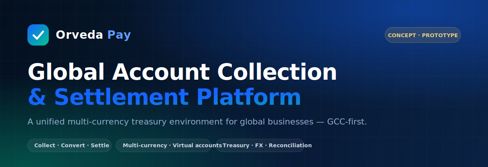

<h1 align="center">Orveda Pay — Global Account Collection &amp; Settlement Platform</h1>

  <strong>A next-generation financial infrastructure concept for collecting, managing, and settling funds across multiple countries and currencies — through a single unified treasury environment.</strong>

  
  
  

  
  
  
  
  
  

> [!IMPORTANT]
> **Forward-looking concept — please read.**
> Orveda Pay is an **early-stage product concept and working prototype**. It is **not** a licensed,
> regulated, or authorized financial institution, payment institution, e-money issuer, or bank.
> It **holds no license or regulatory approval**, has **no banking authorization**, and **does not
> process real customer funds, payments, or onboarding**. Every capability in this document
> describes **product vision and future regulatory-readiness objectives**, not current legal,
> operational, or licensing status. Forward-looking statements are aspirational and subject to
> change. References to other companies denote *category positioning only* and imply no
> affiliation, partnership, or endorsement.

---

## 📖 Documentation Portal

| Document | Description |
| --- | --- |
| **README** (this file) | Executive whitepaper & platform overview |
| [Architecture](docs/architecture.md) | Layered architecture, components, and data flows |
| [Regulatory Readiness](docs/regulatory-readiness.md) | KYC / KYB / AML / monitoring as capabilities & future objectives |
| [GCC Expansion Strategy](docs/gcc-expansion.md) | Phased market-entry plan |
| [Product Roadmap](docs/roadmap.md) | Three-year roadmap |

---

## 1. Executive Summary

**Orveda Pay** is a financial-technology platform concept designed to give global businesses a
single environment to **collect, hold, convert, and settle money across borders**. Today, a
company operating internationally typically stitches together multiple banks, payment providers,
and spreadsheets — each with its own currencies, cut-off times, fees, and reporting. The result is
fragmented liquidity, slow settlement, and poor treasury visibility.

Orveda Pay envisions a **unified treasury layer**: global collection accounts and virtual accounts
that let a business *receive like a local* in many markets, multi-currency wallets to *hold what
they earn*, an FX layer to *convert on their terms*, and a settlement engine to *pay out and
reconcile* — all behind one API-first platform.

The concept is **GCC-first**, beginning with **Qatar**, then expanding across the wider Gulf, into
Europe, and globally. It is positioned in the same category as global account/collection and
treasury platforms — conceptually comparable to **PingPong, Wise Business, Airwallex, Payoneer,
and Modern Treasury** — while focusing first on the specific needs of GCC businesses, marketplaces,
exporters, importers, and SMEs.

This repository contains the **product vision, architecture, and a production-grade UI prototype**
([live](https://www.orvedapay.com)) that demonstrates the intended experience.

---

## 2. The Market Problem

Cross-border commerce is growing, yet the financial plumbing beneath it remains fragmented,
manual, and slow. Businesses that operate across borders consistently face:

- **🌍 Fragmented international payments** — different providers and rails per corridor, each with
  separate logins, fee schedules, currencies, and settlement timelines.
- **🏦 Multi-bank management complexity** — maintaining accounts across several banks and countries
  multiplies operational overhead, KYC duplication, and reconciliation effort.
- **🧾 Account collection challenges** — receiving from international buyers, marketplaces, and
  platforms often requires local accounts the business cannot easily obtain.
- **📊 Treasury visibility gaps** — cash is scattered across institutions and currencies, so
  finance teams lack a single, real-time view of position and exposure.
- **⏳ Settlement delays** — funds sit in transit for days; payouts to suppliers, sellers, and staff
  are slow and hard to schedule reliably.
- **🔁 Cross-border reconciliation** — matching incoming payments to invoices across currencies,
  references, and timezones is error-prone and labor-intensive.

**Why now:** cross-border B2B payment flows are measured in the tens of trillions of dollars
annually (industry context, not an Orveda metric), digital-first businesses are expanding into new
markets faster than ever, and the GCC is investing heavily in financial-services modernization —
creating room for a treasury-grade, region-first platform.

---

## 3. Product Vision

Orveda Pay is conceived as nine integrated capabilities that together form a unified treasury
environment:

| # | Capability | What it does (concept) |
| --- | --- | --- |
| 1 | **Global Account Collection** | Receive funds internationally through local and virtual collection accounts across supported corridors. |
| 2 | **Multi-Currency Wallets** | Hold balances in multiple currencies; convert only when advantageous. |
| 3 | **Merchant Accounts** | Dedicated accounts for businesses and marketplaces to receive and organize revenue. |
| 4 | **Virtual Accounts** | Programmatically issued account details for collections, sub-ledgers, and per-customer references. |
| 5 | **Treasury Dashboard** | A single real-time view of balances, flows, exposure, and reconciliation status. |
| 6 | **Settlement Engine** | Schedule, batch, and execute payouts with predictable timing and full audit trails. |
| 7 | **FX Conversion Layer** | Transparent currency conversion with clear pricing at the point of action. |
| 8 | **Corporate Payments Hub** | Supplier, payroll, and B2B payments managed from one control plane. |
| 9 | **Marketplace Payout Infrastructure** | Split, hold, and disburse funds to sellers and partners at scale. |

🔗 **Experience the prototype:** **[www.orvedapay.com](https://www.orvedapay.com)**

---

## 4. Platform Architecture

Orveda Pay is designed as a layered, API-first platform. The prototype today is the presentation
and product layer; the diagram also marks the **integration points where regulated services and
banking partners would connect in a future, authorized build**.

  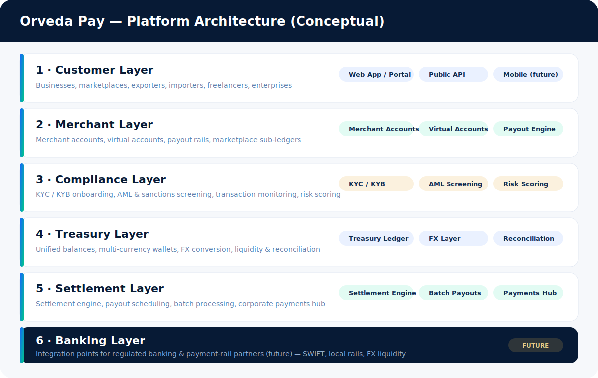

| Layer | Responsibility |
| --- | --- |
| **Customer Layer** | Businesses, marketplaces, exporters, importers, freelancers, enterprises — via web portal & API. |
| **Merchant Layer** | Merchant accounts, virtual accounts, marketplace sub-ledgers, payout rails. |
| **Compliance Layer** | KYC/KYB onboarding, AML & sanctions screening, transaction monitoring, risk scoring. |
| **Treasury Layer** | Unified ledger, multi-currency wallets, FX conversion, liquidity & reconciliation. |
| **Settlement Layer** | Settlement engine, payout scheduling, batch processing, corporate payments hub. |
| **Banking Layer** | *(Future)* integration points for regulated banking and payment-rail partners. |

> 📐 A deeper component-level breakdown is in **[docs/architecture.md](docs/architecture.md)**.

---

## 5. Core Flows

### 5.1 Money Flow

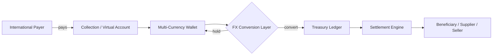

### 5.2 Account Collection Flow

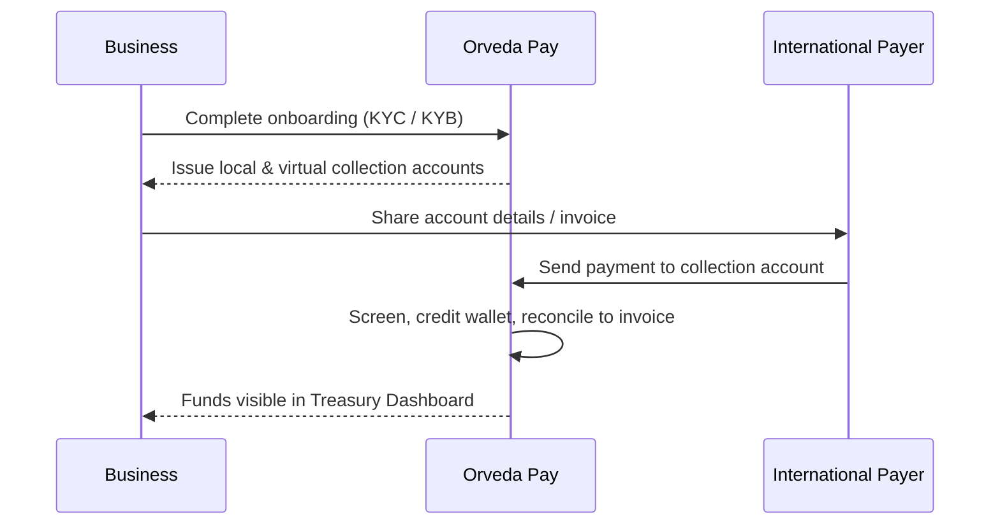

### 5.3 Merchant Settlement Flow

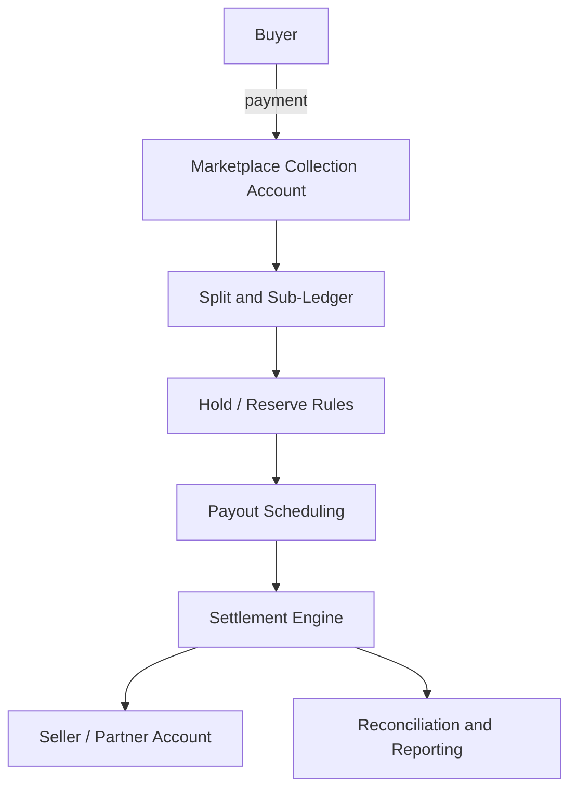

### 5.4 Compliance Workflow

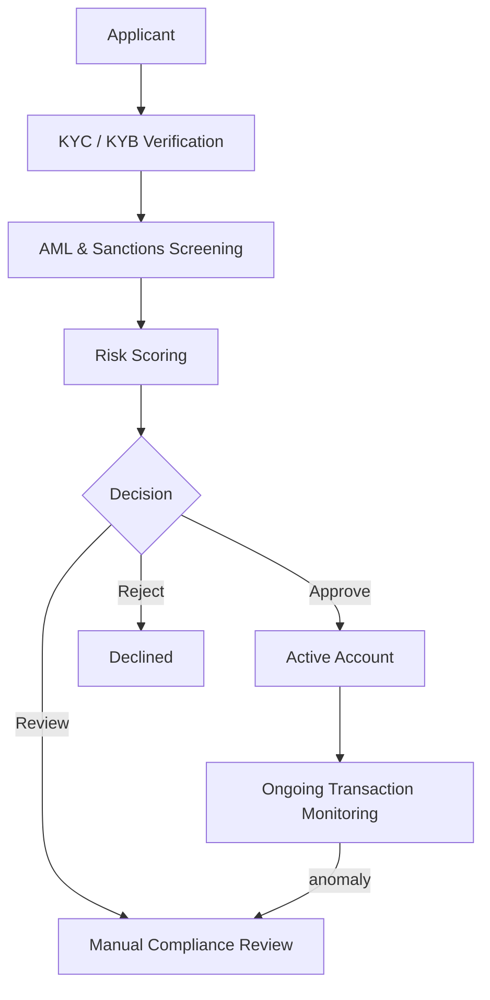

### 5.5 Treasury Operations

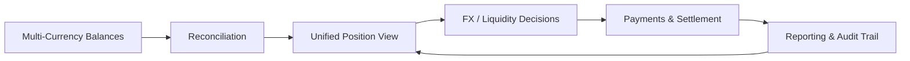

---

## 6. GCC Expansion Strategy

A region-first rollout, deepening capability and compliance readiness before broadening reach.

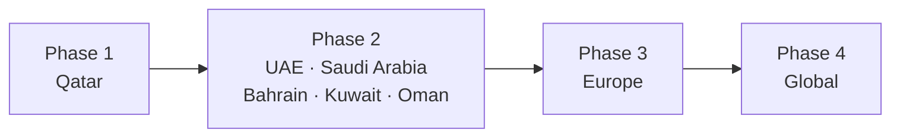

| Phase | Markets | Strategic intent |
| --- | --- | --- |
| **Phase 1** | 🇶🇦 Qatar | Establish the home market, product-market fit, and compliance-readiness foundations. |
| **Phase 2** | 🇦🇪 UAE · 🇸🇦 Saudi Arabia · 🇧🇭 Bahrain · 🇰🇼 Kuwait · 🇴🇲 Oman | Extend across the GCC with shared corridors and treasury depth. |
| **Phase 3** | 🇪🇺 Europe | Enter major trade-corridor markets and broaden currency coverage. |
| **Phase 4** | 🌍 Global | Scale collection and settlement coverage worldwide. |

> Detail in **[docs/gcc-expansion.md](docs/gcc-expansion.md)**.

---

## 7. Regulatory Readiness

> **These are platform capabilities and future regulatory-readiness objectives — not claims of
> any license, authorization, or approval.** Orveda Pay does not currently hold any financial
> license and is not authorized to provide regulated financial services.

Orveda Pay is being designed so that, *if and when* the platform pursues authorization in a given
jurisdiction (via direct licensing or a sponsored/partner model), the compliance foundations are
already first-class product surfaces:

- **KYC** — identity verification of individuals during onboarding.
- **KYB** — verification of business entities, ownership structures, and beneficial owners.
- **AML** — anti-money-laundering controls including sanctions and PEP screening.
- **Transaction Monitoring** — continuous, rule- and risk-based monitoring of flows.
- **Risk Scoring** — customer and transaction risk assessment to drive decisions and reviews.
- **Compliance Workflows** — case management, manual review, audit trails, and reporting.

These map directly to the **Compliance Layer** in the architecture and the **Compliance Workflow**
diagram above. A production, authorized build would additionally require an appropriate regulatory
framework per market, vetted third-party verification/screening providers, independent security
assessment, and a secured backend — **none of which are claimed to exist today**.

> More in **[docs/regulatory-readiness.md](docs/regulatory-readiness.md)**.

---

## 8. Commercial Opportunities

| Opportunity | Concept |
| --- | --- |
| 🛒 **Marketplace Payments** | Collection + split + payout infrastructure for platforms and marketplaces. |
| 🏦 **SME Banking Infrastructure** | Treasury-grade accounts and tooling for small and medium businesses. |
| 🧾 **Merchant Collection Accounts** | Local-style collection accounts for global merchants. |
| 👥 **Payroll Infrastructure** | Cross-border and multi-currency payroll disbursement. |
| 🌐 **B2B Cross-Border Payments** | Supplier and corporate payments across corridors. |
| 💼 **Treasury Management** | Unified balances, FX, reconciliation, and reporting as a service. |

---

## 9. Technology

| Area | Stack |
| --- | --- |
| **Framework** | Next.js 14 (App Router) |
| **Language** | TypeScript 5 |
| **UI** | React 18 + Tailwind CSS 3 + Framer Motion |
| **Architecture** | API-first, component-driven, edge-rendered presentation layer |
| **Deployment** | Cloud-native on Vercel (automatic CI/CD from GitHub) |
| **Imagery / SEO** | Dynamic OG image generation, sitemap, robots, metadata, web manifest |

**Engineering principles:** typed end-to-end, component-driven UI with a shared design system,
edge-first delivery, clear separation between today's presentation layer and tomorrow's regulated
service integrations.

---

## 10. Product Roadmap (3 Years)

| Horizon | Theme | Focus |
| --- | --- | --- |
| **Year 1 · H1** | Foundation | Product concept, design system, prototype UX, onboarding & dashboard surfaces *(done)* |
| **Year 1 · H2** | Identity & Data | Real authentication, encrypted data store, API layer, account state |
| **Year 2 · H1** | Verified Onboarding | Integrated KYC/KYB/AML provider workflows; compliance case management |
| **Year 2 · H2** | Treasury & FX | Multi-currency ledger, FX layer, reconciliation engine (sandbox integrations) |
| **Year 3 · H1** | Settlement | Settlement engine, payout scheduling, marketplace split infrastructure |
| **Year 3 · H2** | Readiness & Scale | Security assessment, regulatory-readiness program, GCC market expansion |

> Detailed roadmap in **[docs/roadmap.md](docs/roadmap.md)**.

---

## 11. Product Prototype — Screenshots

> Captured from the live prototype at [www.orvedapay.com](https://www.orvedapay.com). Dashboard
> figures are **illustrative sample data**.

| | |
| :---: | :---: |
| 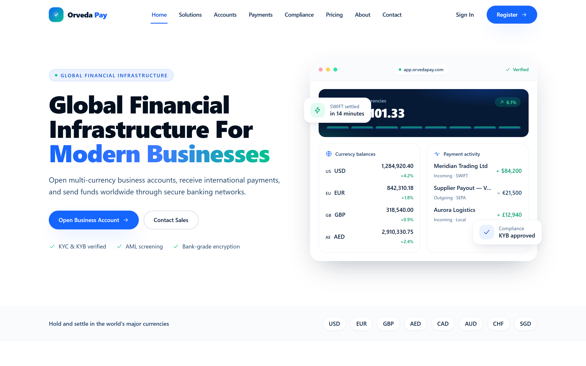 | 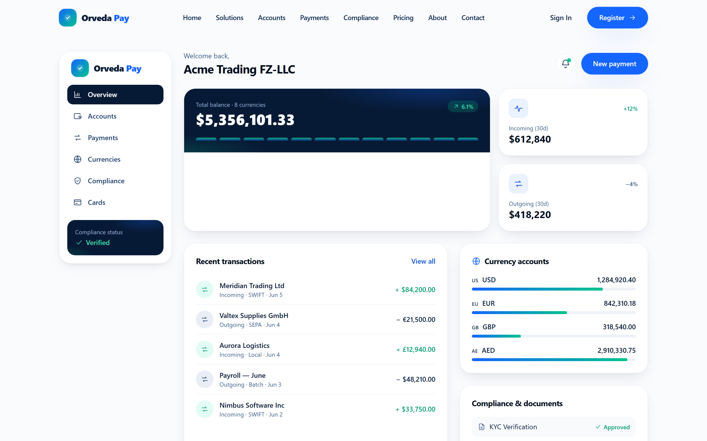 |
| **Platform Home** | **Treasury Dashboard** *(illustrative)* |
| 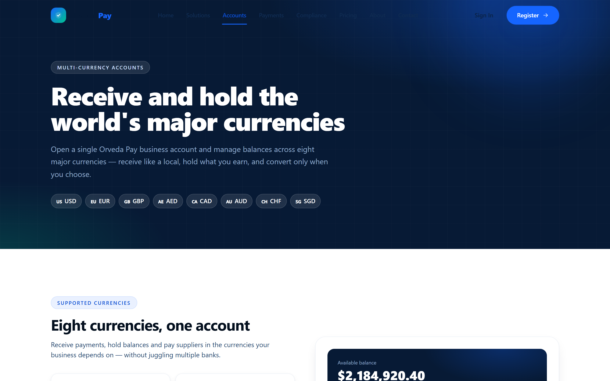 | 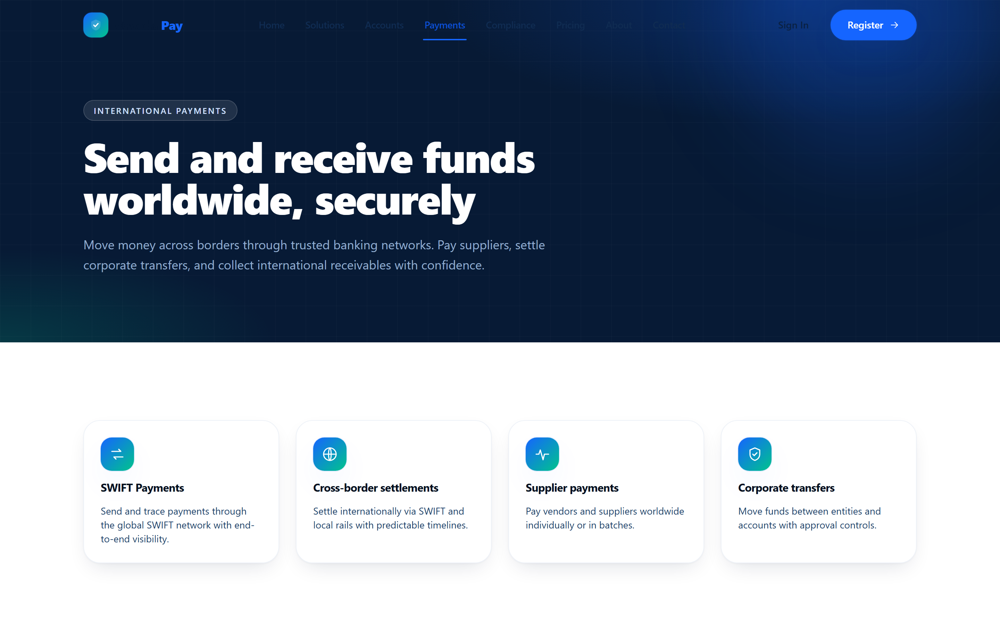 |
| **Multi-Currency Accounts** | **International Payments** |
| 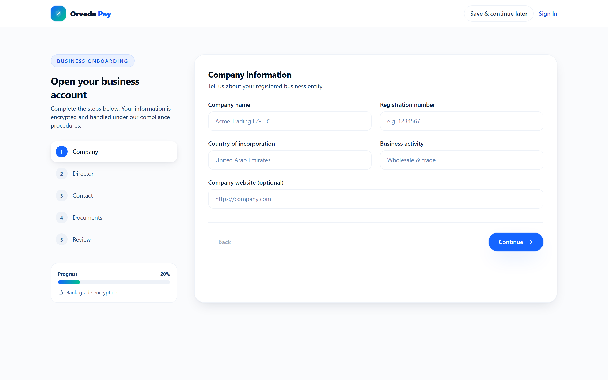 | 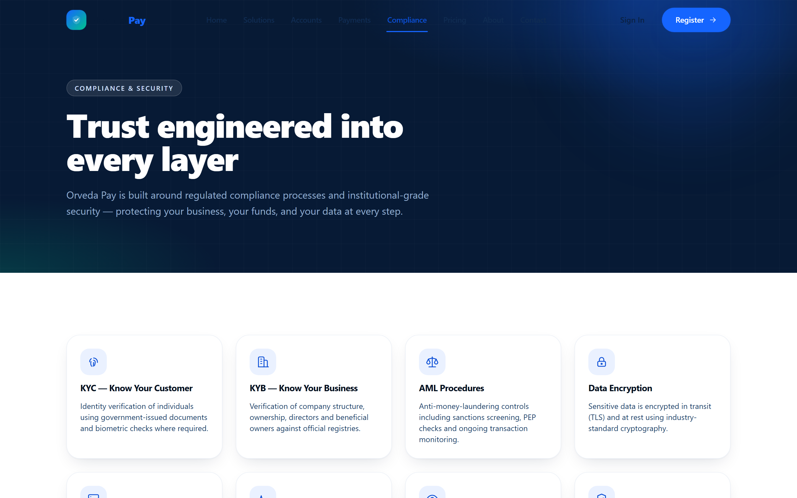 |
| **Onboarding (KYC / KYB)** | **Compliance & Security** |
| 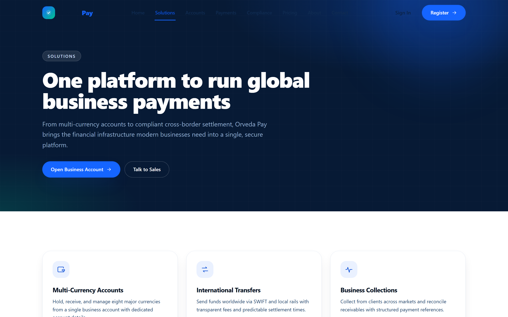 | 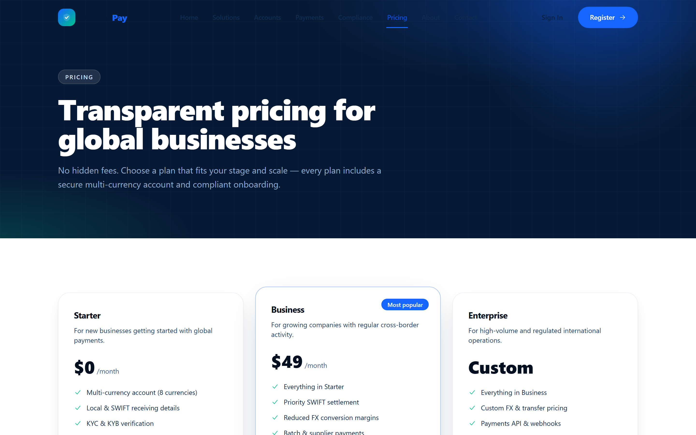 |
| **Solutions** | **Pricing** |

---

## 12. Founder

**Aras Ghorbani**
**Founder · Product Architect · FinTech Systems Designer**

Conceived the Orveda Pay platform vision and designed its product, architecture, and brand. Built
the production-grade prototype end to end — from the design system and treasury/onboarding UX to
the API-first front-end implementation and cloud deployment.

- GitHub: [@arasghorbani9090-web](https://github.com/arasghorbani9090-web)

*(Role descriptions only; no third-party credentials, employers, or affiliations are claimed.)*

---

## 13. Contact

For partnership, technology, or investment conversations about this concept:

- 🌐 **Prototype:** [www.orvedapay.com](https://www.orvedapay.com)
- ✉️ **General:** hello@orvedapay.com
- 💼 **Partnerships / Investment:** sales@orvedapay.com

---

  <strong>Disclaimer.</strong> Orveda Pay is a financial-technology product concept and prototype. It is not a
  licensed, regulated, or operational financial institution and does not process real funds. All
  capabilities, timelines, and market plans are forward-looking objectives subject to change.
  Company references indicate category positioning only and imply no affiliation. © 2026 Orveda Pay.

