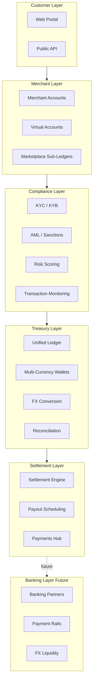

# Platform Architecture

> **Concept document.** Describes the intended architecture of the Orveda Pay platform. The current
> repository implements the presentation/product layer as a prototype. Backend, banking, and
> regulated-service components described here are **future, not yet built**, and no license,
> authorization, or banking relationship is claimed.

[← Back to README](../README.md)

---

## Overview

Orveda Pay is designed as a **layered, API-first platform**. Each layer has a clear responsibility
and a defined integration boundary, so that today's presentation prototype can evolve toward a
production system by adding regulated services behind stable interfaces.

---

## Layer responsibilities

### 1. Customer Layer
The businesses Orveda Pay serves — marketplaces, exporters, importers, freelancers, SMEs, and
enterprises — interacting through a web portal and (future) a public API and mobile clients.

### 2. Merchant Layer
Account constructs that organize money: **merchant accounts**, programmatically issued **virtual
accounts** for collections and per-customer references, and **marketplace sub-ledgers** for
splitting funds across sellers.

### 3. Compliance Layer
First-class onboarding and monitoring surfaces — **KYC/KYB**, **AML & sanctions screening**,
**risk scoring**, and **transaction monitoring** — feeding a case-management and audit workflow.

### 4. Treasury Layer
The financial core: a **unified ledger**, **multi-currency wallets**, an **FX conversion layer**,
and **reconciliation** that gives finance teams one real-time position view.

### 5. Settlement Layer
Execution: a **settlement engine**, **payout scheduling/batching**, and a **corporate payments
hub** for supplier, payroll, and B2B disbursement.

### 6. Banking Layer *(future)*
Integration points for **regulated banking and payment-rail partners** (e.g., SWIFT, local rails,
FX liquidity). Intentionally abstracted so that authorized partners can be integrated without
changing higher layers. **No such integrations or relationships exist today.**

---

## Design principles

- **API-first** — every capability is designed to be exposed and consumed programmatically.
- **Separation of concerns** — presentation today; regulated services behind stable boundaries tomorrow.
- **Typed end-to-end** — TypeScript across the stack for safety and maintainability.
- **Edge-first delivery** — static prerendering for content, dynamic rendering only where needed.
- **Auditability** — every money-movement concept carries a reconciliation and audit trail.

[← Back to README](../README.md)
