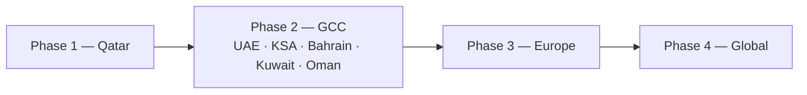

# GCC Expansion Strategy

> **Concept document.** A forward-looking, aspirational market plan. Market entry in any
> jurisdiction is subject to regulatory requirements and approvals that Orveda Pay **does not
> currently hold**. Timelines and sequencing are objectives, not commitments.

[← Back to README](../README.md)

---

## Approach

A **region-first** strategy: establish depth, trust, and compliance-readiness in a home market
before broadening reach. Each phase builds shared corridors, currency coverage, and treasury
capability that the next phase reuses.

---

## Phase 1 — 🇶🇦 Qatar (Home Market)
- Establish the platform's home base and initial product-market fit.
- Build the compliance-readiness foundation (KYC/KYB/AML surfaces, monitoring concepts).
- Focus on local businesses, exporters/importers, and marketplaces needing global collection.

## Phase 2 — Wider GCC
🇦🇪 **UAE** · 🇸🇦 **Saudi Arabia** · 🇧🇭 **Bahrain** · 🇰🇼 **Kuwait** · 🇴🇲 **Oman**
- Extend collection and settlement corridors across the Gulf.
- Deepen multi-currency treasury and FX coverage for regional trade.
- Reuse shared compliance and onboarding infrastructure across markets.

## Phase 3 — 🇪🇺 Europe
- Enter major trade-corridor markets to support GCC↔Europe flows.
- Broaden currency coverage and local collection capability.

## Phase 4 — 🌍 Global
- Scale collection, FX, and settlement coverage worldwide.
- Position as a global account-collection and settlement network.

---

## Why GCC-first

- Strong regional focus on **financial-services modernization** and digital infrastructure.
- High volume of **cross-border trade** (import/export) needing better collection and settlement.
- Opportunity to build a **region-native** treasury platform rather than retrofitting a global one.

[← Back to README](../README.md)
