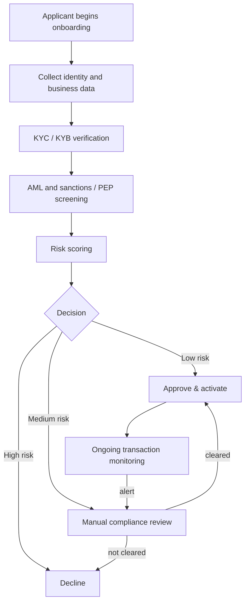

# Regulatory Readiness

> **Important.** This document describes **platform capabilities and future regulatory-readiness
> objectives**. Orveda Pay is a concept and prototype. It **does not hold any financial license**,
> has **no regulatory approval or banking authorization**, and is **not** authorized to provide
> regulated financial services anywhere. Nothing here should be read as a claim of current legal
> status, compliance certification, or partnership.

[← Back to README](../README.md)

---

## Philosophy

Compliance is treated as a **product surface**, not an afterthought. The platform is being designed
so that the building blocks a regulated money-movement business needs are present from the start —
so that *if and when* authorization is pursued in a market (directly or via a sponsored/partner
model), the foundations already exist.

---

## Capability areas (concept)

| Capability | Intended scope |
| --- | --- |
| **KYC** | Identity verification of individuals at onboarding and on review triggers. |
| **KYB** | Verification of business entities, ownership/control structures, and ultimate beneficial owners. |
| **AML** | Anti-money-laundering controls: sanctions screening, PEP checks, watchlist matching. |
| **Transaction Monitoring** | Continuous, rule- and risk-based monitoring of inbound/outbound flows. |
| **Risk Scoring** | Customer- and transaction-level scoring to drive auto-decisions and manual review. |
| **Compliance Workflows** | Case management, manual review queues, decision records, audit trails, reporting. |

---

## Onboarding & monitoring workflow (concept)

---

## What a production, authorized build would require (not in place today)

- An appropriate **regulatory framework per jurisdiction** — via direct licensing or a sponsored /
  partner-bank model.
- Vetted **third-party identity, KYC/KYB, and screening providers**.
- A **secured backend**, encrypted data stores, and independent **security assessment**.
- **Data-protection / privacy-by-design** review aligned to applicable law.
- Ongoing **regulatory engagement** and reporting obligations.

Until those exist and are independently verified, Orveda Pay remains a **concept and prototype**.

[← Back to README](../README.md)
