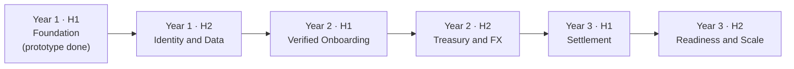

# Product Roadmap (3 Years)

> **Forward-looking.** An aspirational roadmap for evolving the prototype toward a production
> concept. Items beyond the current prototype are **not built**, and regulated capabilities depend
> on approvals Orveda Pay **does not hold**. Subject to change.

[← Back to README](../README.md)

---

---

## Year 1 — Foundation & Core

**H1 · Foundation** ✅ *(prototype complete)*
- Product vision, brand, and design system.
- Marketing/product surfaces, onboarding flow, treasury dashboard UI, authentication UI.
- SEO, performance, and cloud deployment.

**H2 · Identity & Data**
- Real authentication (OAuth / email), session management, user records.
- Encrypted data store and API layer.
- Account-state modeling behind the existing UI.

## Year 2 — Compliance & Treasury

**H1 · Verified Onboarding**
- Integrated KYC/KYB/AML provider workflows.
- Compliance case management, risk scoring, audit trails.

**H2 · Treasury & FX**
- Multi-currency ledger and wallets.
- FX conversion layer and reconciliation engine.
- Sandbox integrations with payment/FX providers.

## Year 3 — Settlement & Scale

**H1 · Settlement**
- Settlement engine, payout scheduling and batching.
- Marketplace split and sub-ledger infrastructure.

**H2 · Readiness & Scale**
- Independent security assessment.
- Regulatory-readiness program per target market.
- GCC market expansion (see [GCC Expansion Strategy](gcc-expansion.md)).

[← Back to README](../README.md)
